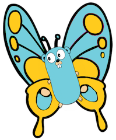

# Metamorphosis

###### ∆ (delta) Metamorphosis




A data structure translation library for go that leverages annotations and reflection.


## Introduction
Metamorphosis allows the use of special "delta" annotation tags to control the translation of one go type struct into another type struct.


## Usage

Add a annotation to the fields in your type structs that begins with the **∆** *(delta)* character followed by the package and type name in dot notation. The value of the annotation tag should be the name of the field in the target type.

In the following example, Frog Species maps to Prince Nationality and the Prince Nationality Maps back to Frog Species


````
package royal

import "github.com/caimeo/metamorphosis/delta"

type Frog struct {
	Name        string `∆.royal.Prince:"Name"`
	Species     string `∆.royal.Prince:"Nationality"`
	Legs        int    `∆.royal.Prince:"Limbs"`
}

type Prince struct {
	Name        string `∆.royal.Frog:"Name"`
	Nationality string `∆.royal.Frog:"Species"`
	Limbs       int    `∆.royal.Frog:"Legs"`
}
````

Next define mutator type functions and generate the mutators.
Mutator type functions are simple from/to functions types that define the transformation.

````
type Magic func(Prince) Frog
type Kiss func(Frog) Prince

var magic Magic
var kiss Kiss

mutator.Create(&magic)
mutator.Create(&kiss)

````

Note that you must create an instance of the function and pass it's pointer to the CreateMutator function.  After the mutator has been created, the functions are now usable.

````
p := Prince{Name:"Harry", Title:"Prince Henry of Wales", Nationality:"English"}
frogHarry := magic(p)   // magic turns a prince into a frog

fmt.Pirntln(reflect.TypeOf(frogHarry)) //-> "royal.Frog"
fmt.Println(frogHarry.Name)            //-> "Harry"
fmt.Println(frogHarry.Species)         //-> "English"

princeHarry := kiss(frogHarry)  // a kiss turns him back into a prince

fmt.Pirntln(reflect.TypeOf(princeHarry)) //-> "royal.Prince"
fmt.Println(princeHarry.Name)            //-> "Harry"
fmt.Println(princeHarry.Nationality)     //-> "English"


````

## Notes

- It is possible to define multiple ∆ tags on that each point to a different type and field.
- Both source and destination fields must be exported from their package
- The current version only operates on simple single level data structures

### Generic / Templating

Metamorphosis is an example of using reflection to obtain a a Java like generic or C++ like template in go. The actual behavior is a cross between the two.

Similar to Java generics, the code of the generic function is untyped and operates on untyped (reflect) values and is evaluated for type correctness at runtime.

Similar to a C++ template, to use the function on a specific type, that specific type implementation of the function must be declared. This function definition while calling the generic code internally is externally type safe.

Unlike either, the actual instantiation of this type specific implementation of the generic function takes place at runtime when you call the ***mutator.Create*** function.


## Roadmap
These are features coming soon

- recursive data structures (structures inside structures)
- map to function (allow field values to be sent to functions instead of fields)


